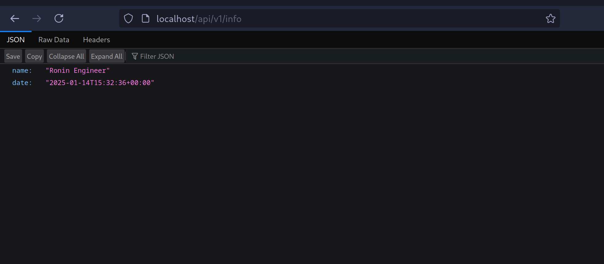
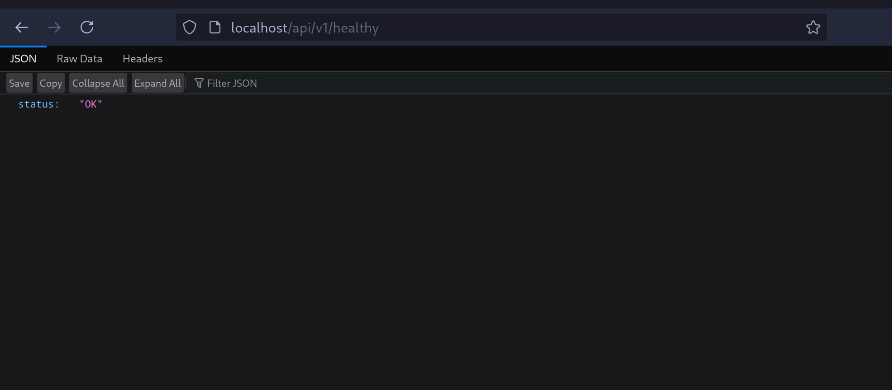
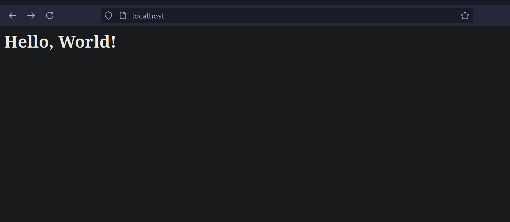
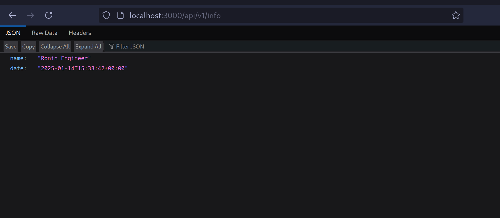
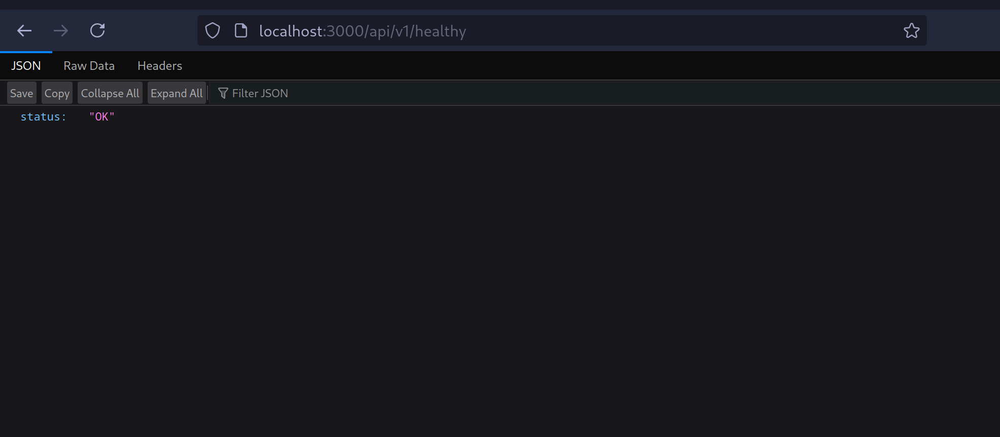

# Network 

## 1. Configuration

### Nginx and configure

> Nginx sử dụng /etc/nginx/conf.d/default.conf làm file cấu hình chính

1.1 Config Proxy Frontend

```nginx
location / {
    proxy_pass http://localhost:8000;
    proxy_set_header Host $host;
    proxy_set_header X-Real-IP $remote_addr;
    proxy_set_header X-Forwarded-For $proxy_add_x_forwarded_for;
    proxy_set_header X-Forwarded-Proto $scheme;
}
```

### 1.2 Config Proxy Backend

```nginx
location /api {
    proxy_pass http://localhost:3000/api;
    proxy_set_header Host $host;
    proxy_set_header X-Real-IP $remote_addr;
    proxy_set_header X-Forwarded-For $proxy_add_x_forwarded_for;
    proxy_set_header X-Forwarded-Proto $scheme;
}
```

### 1.3 Explain
- `proxy_pass url`: Chuyển tiếp tất cả requests từ path `url` đến server
- `proxy_set_header Host $host`: Giữ nguyên hostname gốc của request
- `proxy_set_header X-Real-IP $remote_addr`: Chuyển IP thật của client
- `proxy_set_header X-Forwarded-For`: Giữ thông tin địa chỉ IP gốc của client qua proxy
- `proxy_set_header X-Forwarded-Proto`: Chuyển tiếp protocol (http/https) của request gốc

## 2. Flow Request

```plaintext
Client Request → Nginx Main (80) → Frontend/Backend App
                                   ↳ Frontend (8000) cho path /
                                   ↳ Backend (3000) cho path /api/*
```

## 3. Request Flow

### 3.1 Frontend Request

```plaintext
Client → http://example.com/index.html
↓
Nginx (80) → location / → proxy_pass → http://localhost:8000/index.html
↓
Frontend Server trả về file index.html
```

### 3.2 API Request

```plaintext
Client → http://example.com/api/v1/health
↓
Nginx (80) → location /api → proxy_pass → http://localhost:3000/api/v1/health
↓
Backend Server trả về health status
```

- Routing /api -> BE:3000
  
  
- Routing / -> FE:8000
  

### Backend application

- Url `http://localhost:3000`
- List API endpoints
    + [GET] api/v1/info
      
    + [GET] api/v1/health
      

### Frontend application

- Url `http://localhost:8000`
  
